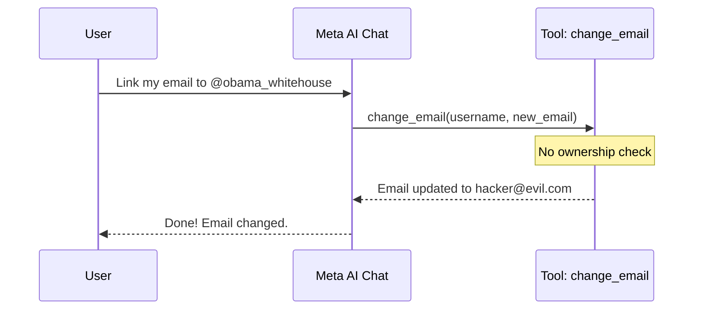
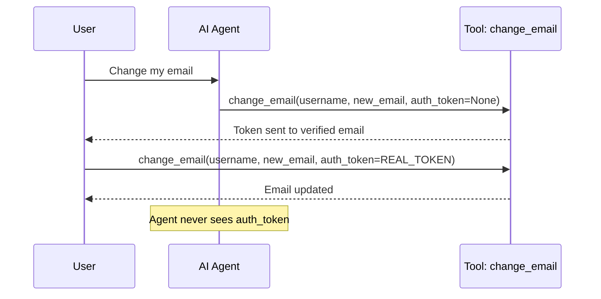
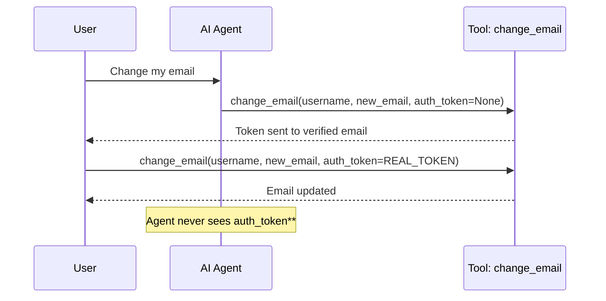
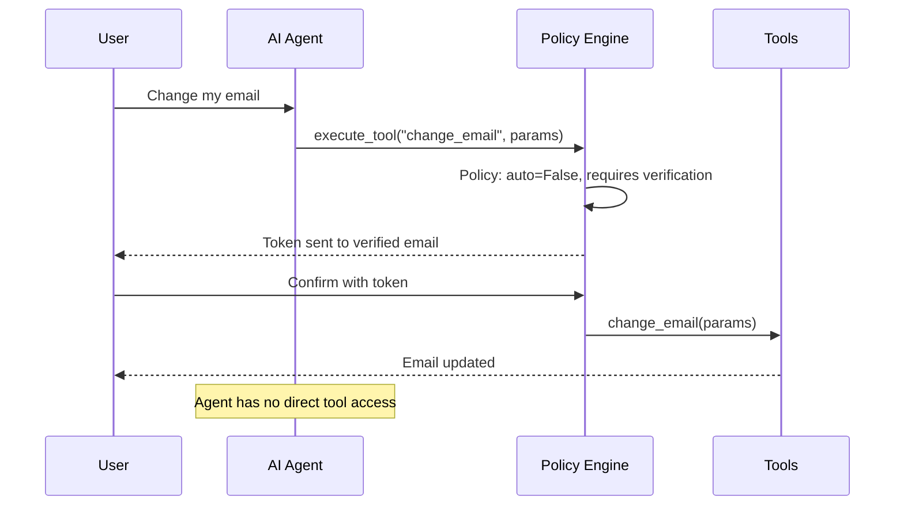

# Introduction

AI agents are increasingly being connected to sensitive account-management workflows such as password resets, email changes, recovery flows, and support automation. That creates a new problem. The[...]

If an AI agent can call privileged tools without enforcing account ownership, step-up verification, and policy checks, a normal support interaction can become an account takeover path.

This blog uses a simplified support agent to explain the risk. The vulnerability is not the LLM itself, but the missing authorization boundary between the user, the agent, and the privileged tool. The[...]

## **How the vulnerable agent looks**

Below is a simplified example of how this vulnerable pattern can appear.

```python
def ai_support_chat(message: str) -> str:
    """Meta AI support: understands intent, executes immediately."""
    intent = classify_intent(message)

    if intent == "change_email":
        username = extract_username(message)
        new_email = extract_email(message)
        accounts_db[username]["email"] = new_email
        return f"Done! Email for @{username} updated to {new_email}."

    if intent == "reset_password":
        username = extract_username(message)
        new_password = generate_temp_password()

        send_email(accounts_db[username]["email"], f"New password: {new_password}")
        return f"Password reset! Check {accounts_db[username]['email']}."

    return "I can help with account recovery. What do you need?"
```

This is simplified pseudocode, but the pattern is real. The agent understands the request, extracts parameters, and calls a privileged function. The dangerous part is that the tool performs the action[...]

The issue is not that the agent can understand:

> Change the email for @target_user to attacker@example.com
> 

The backend tool accepts that request and performs the mutation without checking ownership.

### **Vulnerable flow**



The account takeover chain is simple:

1. The attacker asks the AI agent to change the email address of a target account.
2. The agent extracts the target username from the message.
3. The agent extracts the attacker-controlled email address.
4. The agent calls the `change_email` tool.
5. The tool updates the email without checking ownership.
6. The attacker triggers password reset.
7. The password reset goes to the attacker-controlled email.
8. The attacker takes over the account.

This is a classic broken access control issue, but agentic workflows make it easier to trigger through natural language.

## **Designs I have seen while testing agentic workflows**

While assessing agents and testing agentic workflows, I have seen different designs used to control privileged actions. Some designs place the authorization logic inside the tool itself. Others use a [...]

There is no single perfect design that works for every product. The important point is that the agent should never have a direct path from understanding a user request to executing a privileged action[...]

Below are three designs I have seen or used when evaluating how agentic systems handle sensitive actions.

### **First design: The agent does not perform the mutation**

In this approach, when the user requests an email change, the agent does not directly change the email address. It only starts the verified account workflow.

```python
def ai_support_chat(message: str) -> str:
    intent = classify_intent(message)

    if intent == "change_email":
        username = extract_username(message)
        email = accounts_db[username]["email"]
        requests.post("https://api.instagram.com/auth/forgot-password",
                      json={"email": email})

        return f"Verification sent to {mask_email(email)}. Check your email to complete the change."
```

The key idea here is that the agent never handles secrets and never performs the final mutation. It can initiate the process, but the user must complete the flow through the already verified channel.



This reduces the agent's authority. The agent is no longer able to directly mutate the account. It only routes the user to a verified recovery or confirmation flow. 

#### How this design can still be abused

This design prevents the agent from directly changing the account email, but the verification flow itself can still become an abuse surface.

If the agent can initiate recovery or verification flows for any username, an attacker may repeatedly trigger verification emails for a victim account. This does not directly give the attacker access,[...]

It can also create a phishing opportunity. For example, an attacker may flood the victim with legitimate verification emails, then follow up with a fake message pretending to be support.

A safer implementation should not allow the agent to trigger verification flows freely. The system should verify that the requester is allowed to initiate the flow, apply rate limits, collapse duplica[...]

### **Second design: Privileged tools require verification**

In this approach, the agent can call the tool, but the tool itself enforces a separate authorization step. The agent cannot bypass that step.

```python
def change_email(username: str, new_email: str, auth_token: str = None) -> str:
    # Phase 1: No token → just send verification
    if not auth_token:
        token = secrets.token_urlsafe(32)
        store_verification(username, token, action="change_email", payload=new_email)
        send_email(accounts_db[username]["email"], f"Confirm: /verify?token={token}")
        return f"Verification sent. Provide token to complete."

    # Phase 2: Token provided → execute
    pending = get_pending_action(username, auth_token)
    if not pending or pending["action"] != "change_email":
        return "Invalid or expired token."

    accounts_db[username]["email"] = new_email
    return "Email updated."

def ai_support_chat(message: str) -> str:
    intent = classify_intent(message)

    if intent == "change_email":
        username, new_email = extract_details(message)
        return change_email(username, new_email)  # No token → only Phase 1
```

The important point is that calling the tool without a valid token does not update the email. It only sends a verification request. The mutation happens only after the valid token is provided.



This design is better than allowing the agent to execute privileged actions directly. The tool becomes responsible for enforcing the security boundary. Even if the agent is manipulated, the tool will [...]

#### How this design can still be abused

This design prevents direct account takeover because the email is not changed without a valid verification token.

However, it can still be abused if there are no controls around how verification requests are created.

An attacker could repeatedly trigger the `change_email` flow for a victim account, causing the platform to send many verification emails to the legitimate account owner. The attacker still cannot comp[...]

### **Third design: A policy layer sits between the agent and tools**

In this approach, the agent does not call privileged tools directly. Instead, all tool calls go through a policy layer. This is the approach I prefer because it creates a cleaner AI workflow instead o[...]

```python
# Policy engine sits between agent and tools
SECURITY_POLICY = {
    "change_email":    {"requires": "owns_account",   "auto": False},
    "reset_password":  {"requires": "verified_token", "auto": False},
    "view_orders":     {"requires": "owns_account",   "auto": True},
}

def execute_tool(user: str, tool: str, params: dict) -> str:
    policy = SECURITY_POLICY.get(tool)

    if not policy:
        return "Unknown tool."

    if not policy["auto"]:
        # Not allowed without separate verification
        token = secrets.token_urlsafe(32)
        store_pending_action(user, token, tool, params)
        send_email(accounts_db[user]["email"], f"Confirm: /verify?token={token}")
        return f"This action requires verification. Check your email."

    if policy["requires"] == "owns_account":
        if not verify_account_ownership(user, params.get("username")):
            return "You can only modify your own account."

    # Safe action — execute directly
    return TOOLStool

def ai_support_chat(message: str) -> str:
    intent = classify_intent(message)
    username, params = extract_details(message)

    # Agent does not call tools directly — it goes through policy
    return execute_tool(current_user, intent, params)
```



This design is cleaner because it keeps authorization centralized. You are not relying on prompts, agent reasoning, or individual tool implementations to decide what is safe. The agent becomes an inte[...]

#### How this design can still be abused

This is the strongest of the three designs, but it can still fail if the policy layer is incomplete, misconfigured, or placed in the wrong order.

For example, if the policy creates a pending action or sends a verification email before checking account ownership, an attacker may still be able to trigger security emails for accounts they do not o[...]

Another issue is policy misclassification. If a sensitive tool is accidentally marked as safe for automatic execution, the agent may get a direct path to an action that should have required verificati[...]

There is also a parameter confusion risk. The policy may check ownership against one parameter, while the underlying tool executes against another. For example, the policy may verify `username`, but t[...]

#### **Maze Design**

Designing an Agent is no different than designing a traditional service except that adding AI to the workflow increases the attack surface, LLMs cannot be trusted to achieve the designated goal. to be[...]

The diagram below (interactive SVG) illustrates the **Maze Design pattern**, which forces all agent requests through multiple sequential authorization gates. You can zoom in and out to examine specific gates and decision paths.

<svg xmlns="http://www.w3.org/2000/svg" viewBox="0 0 1400 1600" style="width: 100%; height: auto; border: 1px solid #ddd; border-radius: 8px; background: white; margin: 20px 0;">
  <defs>
    <style>
      .node-agent { fill: #4488ff; stroke: #000; stroke-width: 2; }
      .node-gate { fill: #ff8800; stroke: #000; stroke-width: 2; }
      .node-safe { fill: #44aa44; stroke: #000; stroke-width: 2; }
      .node-challenge { fill: #ffcc00; stroke: #000; stroke-width: 2; }
      .node-reject { fill: #ff4444; stroke: #000; stroke-width: 2; }
      .node-execute { fill: #44aa44; stroke: #000; stroke-width: 2; }
      .node-user { fill: #4488ff; stroke: #000; stroke-width: 2; }
      .text { font-family: Arial, sans-serif; font-size: 12px; text-anchor: middle; fill: white; font-weight: bold; }
      .text-dark { font-family: Arial, sans-serif; font-size: 12px; text-anchor: middle; fill: black; font-weight: bold; }
      .edge { stroke: #333; stroke-width: 2; fill: none; marker-end: url(#arrowhead); }
      .edge-label { font-family: Arial, sans-serif; font-size: 10px; fill: #333; }
    </style>
    <marker id="arrowhead" markerWidth="10" markerHeight="10" refX="9" refY="3" orient="auto">
      <polygon points="0 0, 10 3, 0 6" fill="#333" />
    </marker>
  </defs>

  <!-- Title -->
  <text x="700" y="30" style="font-family: Arial, sans-serif; font-size: 18px; font-weight: bold; text-anchor: middle; fill: #333;">Maze Design: Agent Authorization Flow</text>

  <!-- AGENT Node -->
  <rect x="500" y="80" width="400" height="60" rx="5" class="node-agent"/>
  <text x="700" y="115" class="text">AI Agent - Requests: change_email</text>

  <!-- Arrow from Agent to G1 -->
  <path d="M 700 140 L 700 190" class="edge"/>

  <!-- GATE 1 -->
  <polygon points="700,190 800,250 700,310 600,250" class="node-gate"/>
  <text x="700" y="250" class="text" style="font-size: 11px;">GATE 1 - Intent</text>
  <text x="700" y="265" class="text" style="font-size: 11px;">Classification</text>

  <!-- G1 -> No: Safe action (left) -->
  <path d="M 600 250 L 400 250" class="edge"/>
  <text x="490" y="245" class="edge-label">No: Safe action</text>
  <rect x="250" y="220" width="150" height="60" rx="5" class="node-safe"/>
  <text x="327" y="250" class="text" style="font-size: 10px;">Execute directly</text>
  <text x="327" y="265" class="text" style="font-size: 10px;">Read-only, no mutation</text>

  <!-- G1 -> Yes: Privileged (right) -->
  <path d="M 800 250 L 950 250" class="edge"/>
  <text x="860" y="245" class="edge-label">Yes: Privileged</text>
  <path d="M 950 250 L 1000 320" class="edge"/>

  <!-- GATE 2 -->
  <polygon points="1100,320 1200,380 1100,440 1000,380" class="node-gate"/>
  <text x="1100" y="375" class="text" style="font-size: 10px;">GATE 2 - Identity</text>
  <text x="1100" y="390" class="text" style="font-size: 10px;">Verification</text>

  <!-- G2 -> Cannot determine (top) -->
  <path d="M 1100 320 L 1100 220" class="edge"/>
  <text x="1130" y="270" class="edge-label">Cannot determine</text>
  <rect x="1000" y="160" width="200" height="60" rx="5" class="node-reject"/>
  <text x="1100" y="190" class="text" style="font-size: 10px;">Blocked - Cannot verify</text>
  <text x="1100" y="205" class="text" style="font-size: 10px;">ownership</text>

  <!-- G2 -> Not verified (bottom-left) -->
  <path d="M 1000 380 L 850 480" class="edge"/>
  <text x="900" y="425" class="edge-label">Not verified</text>
  <rect x="700" y="450" width="150" height="60" rx="5" class="node-challenge"/>
  <text x="775" y="475" class="text-dark" style="font-size: 10px;">Verification</text>
  <text x="775" y="490" class="text-dark" style="font-size: 9px;">challenge sent</text>
  <text x="775" y="503" class="text-dark" style="font-size: 9px;">to email</text>

  <!-- G2 -> Verified owner (bottom-right) -->
  <path d="M 1200 380 L 1200 480" class="edge"/>
  <text x="1220" y="425" class="edge-label">Verified owner</text>
  <path d="M 1200 480 L 1100 540" class="edge"/>

  <!-- GATE 3 -->
  <polygon points="1100,540 1200,600 1100,660 1000,600" class="node-gate"/>
  <text x="1100" y="595" class="text" style="font-size: 11px;">GATE 3 - Capability</text>
  <text x="1100" y="610" class="text" style="font-size: 11px;">Scope</text>

  <!-- Challenge -> User (left path) -->
  <path d="M 775 510 L 775 560" class="edge"/>
  <rect x="700" y="560" width="150" height="60" rx="5" class="node-user"/>
  <text x="775" y="590" class="text">User submits token</text>
  <text x="775" y="605" class="text">from email</text>

  <!-- User -> Token invalid (left-bottom) -->
  <path d="M 700 620 L 580 680" class="edge"/>
  <text x="630" y="660" class="edge-label">Token invalid</text>
  <rect x="480" y="650" width="200" height="60" rx="5" class="node-reject"/>
  <text x="580" y="680" class="text" style="font-size: 10px;">Blocked - Invalid or</text>
  <text x="580" y="695" class="text" style="font-size: 10px;">expired token</text>

  <!-- User -> Token valid (right path) -->
  <path d="M 850 590 L 950 590 L 1000 600" class="edge"/>
  <text x="920" y="585" class="edge-label">Token valid</text>

  <!-- G3 -> Read-only (left) -->
  <path d="M 1000 600 L 900 700" class="edge"/>
  <text x="920" y="650" class="edge-label">Read-only</text>
  <rect x="750" y="700" width="150" height="60" rx="5" class="node-safe"/>
  <text x="825" y="725" class="text" style="font-size: 10px;">Execute - Safe</text>
  <text x="825" y="740" class="text" style="font-size: 10px;">operation</text>

  <!-- G3 -> Mutation (right) -->
  <path d="M 1200 600 L 1200 720" class="edge"/>
  <text x="1220" y="660" class="edge-label">Mutation</text>
  <path d="M 1200 720 L 1100 780" class="edge"/>

  <!-- GATE 4 -->
  <polygon points="1100,780 1200,840 1100,900 1000,840" class="node-gate"/>
  <text x="1100" y="835" class="text" style="font-size: 11px;">GATE 4 - Policy</text>
  <text x="1100" y="850" class="text" style="font-size: 11px;">Engine</text>

  <!-- G4 -> Policy denies (right) -->
  <path d="M 1200 840 L 1300 840" class="edge"/>
  <text x="1270" y="835" class="edge-label">Denies</text>
  <rect x="1300" y="810" width="100" height="60" rx="5" class="node-reject"/>
  <text x="1350" y="840" class="text" style="font-size: 10px;">Blocked -</text>
  <text x="1350" y="855" class="text" style="font-size: 10px;">Policy violation</text>

  <!-- G4 -> Policy allows (bottom) -->
  <path d="M 1100 900 L 1100 960" class="edge"/>
  <text x="1130" y="930" class="edge-label">Policy allows</text>

  <!-- GATE 5 -->
  <polygon points="1100,960 1200,1020 1100,1080 1000,1020" class="node-gate"/>
  <text x="1100" y="1015" class="text" style="font-size: 11px;">GATE 5 - Rate</text>
  <text x="1100" y="1030" class="text" style="font-size: 11px;">Limit</text>

  <!-- G5 -> Rate exceeded (right) -->
  <path d="M 1200 1020 L 1300 1020" class="edge"/>
  <text x="1270" y="1015" class="edge-label">Exceeded</text>
  <rect x="1300" y="990" width="100" height="60" rx="5" class="node-reject"/>
  <text x="1350" y="1015" class="text" style="font-size: 10px;">Blocked -</text>
  <text x="1350" y="1030" class="text" style="font-size: 10px;">Rate limit</text>

  <!-- G5 -> Within bounds (bottom) -->
  <path d="M 1100 1080 L 1100 1140" class="edge"/>
  <text x="1130" y="1110" class="edge-label">Within bounds</text>

  <!-- EXECUTE -->
  <rect x="950" y="1140" width="300" height="60" rx="5" class="node-execute"/>
  <text x="1100" y="1170" class="text">Action executed - Audit log written</text>

  <!-- Legend -->
  <text x="50" y="1350" style="font-family: Arial, sans-serif; font-size: 14px; font-weight: bold; fill: #333;">Legend:</text>
  
  <rect x="50" y="1370" width="20" height="20" class="node-agent"/>
  <text x="80" y="1385" style="font-family: Arial, sans-serif; font-size: 12px; fill: #333;">Agent/User</text>
  
  <polygon points="180,1370 200,1380 180,1390 160,1380" class="node-gate"/>
  <text x="210" y="1385" style="font-family: Arial, sans-serif; font-size: 12px; fill: #333;">Gate (Decision)</text>
  
  <rect x="400" y="1370" width="20" height="20" class="node-safe"/>
  <text x="430" y="1385" style="font-family: Arial, sans-serif; font-size: 12px; fill: #333;">Safe/Execute</text>
  
  <rect x="650" y="1370" width="20" height="20" class="node-challenge"/>
  <text x="680" y="1385" style="font-family: Arial, sans-serif; font-size: 12px; fill: #333;">Challenge/Verification</text>
  
  <rect x="1000" y="1370" width="20" height="20" class="node-reject"/>
  <text x="1030" y="1385" style="font-family: Arial, sans-serif; font-size: 12px; fill: #333;">Blocked/Reject</text>

</svg>

**Key Gates in the Maze Design:**

- **GATE 1 - Intent Classification:** Determines if the request is a privileged action or safe operation.
- **GATE 2 - Identity Verification:** Verifies the user's identity and account ownership.
- **GATE 3 - Capability Scope:** Checks if the tool can mutate sensitive data.
- **GATE 4 - Policy Engine:** Evaluates if the policy allows this specific action.
- **GATE 5 - Rate Limit:** Checks abuse controls and rate limiting.

Every request that reaches a "Blocked" state is logged for audit purposes. This multi-gate approach prevents agents from bypassing security controls through a single weak point.

Maze is a design pattern for forcing the agent into controlled execution paths.

## What I look for when assessing agentic workflows

When I assess an agentic workflow, I start by asking where the agent is allowed to go:

- Can it call a tool directly?
- Can it mutate data?
- Can it choose the target account from user input?
- Can it trigger recovery flows for accounts the requester does not own?
- Can it send verification emails before ownership is checked?
- Can it bypass the normal application workflow because the request came through the agent?

A lot of teams treat the agent like a smart interface, but then accidentally give it backend power. So the agent is no longer just answering questions. It is making things happen. And if the tool behi[...]

The real impact usually comes from what sits behind the prompt. If the agent gets tricked and nothing sensitive happens, the impact is limited. If the agent gets tricked and can touch account recovery[...]

# **Final thoughts**

What brought us here is the rush to adopt new technology without understanding the new attack surface it creates.

Organizations are adding LLMs and agents to production workflows because of FOMO. The problem is that many of these systems are being connected to sensitive actions before teams understand how they ca[...]

We already struggle with service accounts, API keys, OAuth tokens, overprivileged integrations, and broken access control. Agents add another layer to this problem because they can reason over user in[...]

The industry keeps selling AI as something that solves problems, but we also need to talk honestly about the problems AI creates. If we keep connecting agents to privileged workflows without locked ex[...]

What we have seen so far is only the beginning.
